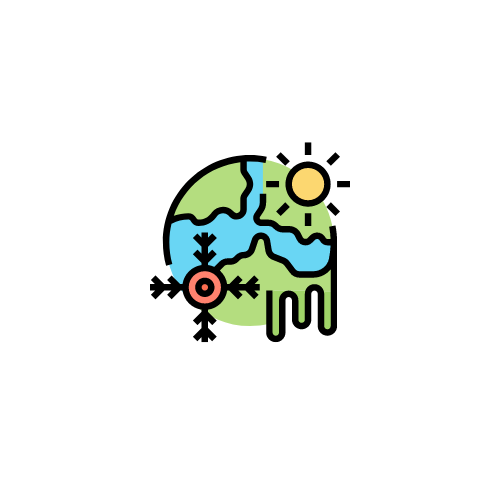

<h2 align="center">Hackzurich 2022</h2>
 

  

<h2 align="center">Hackzurich 2022</h2>

## Summary

QuizzerLand is a gamified educational app leveraging the open data project of the Swiss government. 
The core features of our app consists of questions about both past metrics and future projections of sustainability topics such as water availability, energy consumption and urban head islands. 
Correct answers gives the user points which translates into GreenCoin, a currency that can be used in the app to either 1) purchase sustainable products (e.g., local markets), or 2) donate to non-profit organizations engaged with sustainability causes. 

## Inspiration

The two most common life-crisis we all face is getting older and climate change. 
Working with a team of user researchers, we helped discover the sensibilities of each generation. 
After a further study into the applications they are using, we tried to find similarities in their usage behaviors and habits. 
This led us to creating a unique game based mobile application that is fast paced, challenging and fun. 
And yes, that is more than just a mobile app!

## What it does

The main objective of our app is to bring more awareness to the population, specially young people who did not have enough time to witness how rapidly our planet is changing due to sustainability related topics.	

## How we built it

A mobile app was built that leverages on unconscious learning by gamifying content and making it more fun. User research was conducted to determine the commonalities of the elderly and younger generations when using apps. A game-based approach was chosen so that the youngster can learn with fun while the older people get familiarized with mobile apps and applications developed for them. Users are rewarded by completing tasks in the game, which triggers their brain to start processing information better, faster, and more efficiently.

## Challangues we ran into

The open data is a valuable but also challenging resource to work with. 
Considering the limited amount of time, doing proper statistical analysis to derive valuable facts from the data was the main challenge of our project. 
However, we build the app such that it can easily be extended to cover more questions, facts and analysis in the future.

## Accomplishments that we're proud of

* Creating a team of four that all of us are girls!
* Collaborating with three different nationalities.
* We got out of our comfort zone and push ourselves to the limits.
* Used the Generation Z apps for our pitch video 🎬

## What we learned

* Design thinking approach helps to bring creative ideas.
* Making trade offs are vital to deliver the first MVP.

## What's next for Quizzerland

* Integrating more analysis features based on the collected data.
* Providing market place for local shops and sustainable producers to showcase and promote their products.
* Expand on question database.
* Explore data visualization for quizzes from the projection with more.
* Expand partnerships to enable good causes from government and NGOs to get donations and engage with citizens.  
* Giving citizens the chance of spending their collected earn points.
* Providing badges and certificates to users of the application as part of reward program.  
* Providing Android and Web application to target wider audience.  

## Built with

* Languages: Swift, SwiftUI

## Features

1. True/False Questions

In this mode, users have access to flash cards with statements and have to say whether they are true/false by swapping left/right.

2. Multi-Option Questions

In this mode, users are given 4 possible answers to the posed questions. 
If the wrong answer is chosen, the user can continue trying until the correct one is selected. 
The number of gained points depends on the number of trials until the correct answer is selected as well as how long it took.

3. Open Questions

In this mode, users have an open end question where they can guess the answer within a given range. 
If no user gets the answer correctly, the user with the closest answer will be the winner. 
For this case the number of points earned are calculated based on the number of users guessing 
as well as how close the user's answer was to the correct one. 

4. Leaderboard

In the leaderboard view, the users can see where they stand in comparison to other users. 

5. Social Media Sharing

This feature allows users to share they knowdged on social media, attracting more people to use the app.

6. Marketplace

In this section, users can leverage their earned points to either 1) purchase sustainable products (e.g., local markets), 
or 2) donate to non-profit organizations engaged with sustainability causes. 
